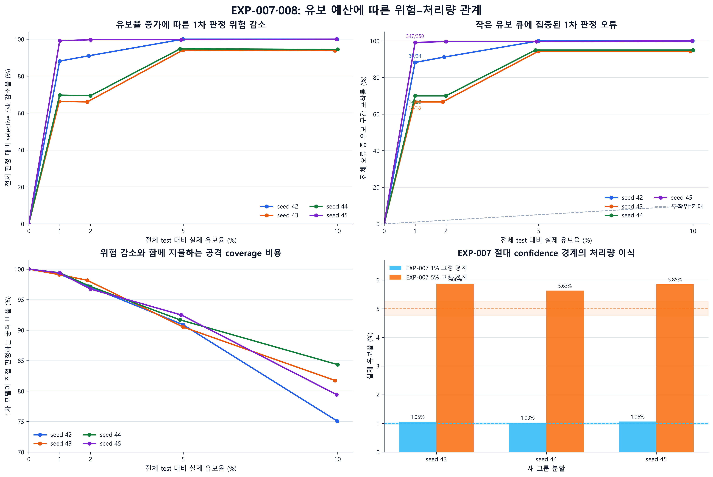

# 1차 Confidence Abstention SubExperiment 종료 보고서

- 종료 대상: LightGBM 1차 게이트의 confidence 기반 선택적 유보 가능성 검증
- 포함 실험: EXP-007, EXP-008
- 데이터: CIC-IDS2017 CNS2022 재처리판
- 종료 판정일: 2026-09-16
- 종료 상태: **연구 질문에 대한 내부 존재 검증 완료**

이 문서는 실험 결과에 근거한 종료 보고서다. 프로젝트 단계와 결정의 정본은
`docs/CURRENT_DECISIONS.md`이며, 해당 정본의 상태 변경은 저장소 문서 관리자가 별도로 반영한다.

## 1. 종료 판단

이 SubExperiment는 다음 질문에 답하기 위해 수행했다.

> 전체 트래픽 대비 유보 구간 비율에 따라 1차 판정 위험이 어떻게 변화하며, 소수 비율의
> 심층 검증만으로 유의미한 위험 저감이 가능한가.

EXP-007과 EXP-008의 결과를 종합하면, **같은 재처리 데이터와 현재 LightGBM·피처·분할 규칙
안에서 confidence가 낮은 소수 트래픽에 1차 판정 오류가 집중되는 유보 구간이 존재한다.**
약 1%를 유보했을 때 네 그룹 분할에서 전체 오류의 66.7~99.1%, 약 5%를 유보했을 때
94.4~100%가 유보 구간에 포함됐다. 이에 따라 1차 모델이 직접 판정하는 수용 구간의 위험도
크게 감소했다.

따라서 이 SubExperiment의 중심 질문인 **유보 구간의 존재와 budget별 위험 감소 가능성은
확인된 것으로 종료한다.** 같은 데이터에서 seed만 추가하는 반복 실험은 현재 우선 과제로 두지
않는다. 다음 단계는 이 결과를 LightGBM ML-IDS의 budget 기반 1차 게이트로 구현하고, 실제
2차 검증기를 연결해 종단간 위험 감소를 측정하는 것이다.

이 종료는 외부 데이터 일반화나 배포 완료를 뜻하지 않는다. 현재 확인한 것은 2차 검증의
**대상을 효율적으로 선별할 가능성**이며, 로컬 LLM·RAG가 유보 오류를 실제로 교정한다는 사실은
후속 단계에서 별도로 검증해야 한다.

## 2. 실험 범위와 증거 사슬

### 2.1 EXP-007: 유보 구간 존재 검증

EXP-007은 D-004 `group_seed42` 분할에서 LightGBM confidence가 오류를 무작위보다 잘
순위화하는지 검증했다. 59개 입력 피처 값이 완전히 같은 행은 train과 test 사이에서 나누지
않았고, 모델 후보와 반복 수는 내부 validation으로 결정한 뒤 외부 test를 한 번 평가했다.

주 분석 결과는 다음과 같다.

| 항목 | 결과 |
|---|---:|
| 외부 test | 482,382행 |
| 전체 오류 | 34건 |
| AURC | 4.5225×10⁻⁷ |
| random AURC | 7.0484×10⁻⁵ |
| AURC 상대 개선 | 99.36% |
| 약 1% 유보 오류 포착 | 30/34, 88.2% |
| 약 5% 유보 오류 포착 | 34/34, 100% |
| 사전 판정 | 성공 |

이 결과로 현재 데이터와 주 분할에서 유보 구간이 존재한다는 1차 근거를 확보했다. 동시에
전체 오류가 34건에 불과하고 confidence 절대값이 극단에 몰려 있다는 위험 신호도 확인했다.

### 2.2 EXP-008: 그룹 분할 seed 민감도 분석

EXP-008은 모델 후보 C06과 230 iteration을 고정하고, 완전일치 피처 그룹의 배정 seed만
43·44·45로 바꿨다. EXP-007 test 결과를 보고 모델을 다시 선택하거나 반복 수를 조절하지
않았다. 평가 목적은 다음 두 성질을 분리해 확인하는 것이었다.

1. confidence의 오류 순위 효과가 다른 그룹 배정에서도 사전 허용폭 안에 유지되는가.
2. EXP-007의 절대 confidence 경계가 다른 그룹 배정에서도 같은 유보 처리량을 만드는가.

모든 입력 해시, 대상 행, split 교차 여부, 모델 설정, 예측 행 수, AURC 산술, 산출물 해시 검사를
통과해 기술적으로 유효한 실행이었다. 공식 판정은 다음과 같다.

| 판정 축 | seed 43 | seed 44 | seed 45 | 종합 |
|---|---|---|---|---|
| 오류 순위 안정성 | 실패 | 실패 | 유지 | 실패 |
| 고정 경계 처리량 | 실패 | 판정 불가 | 실패 | 실패 |

이 실패는 유보가 위험을 줄이지 못했다는 뜻이 아니다. EXP-007의 매우 강한 AURC 효과 크기를
사전에 정한 3배 허용폭 안에서 재현하지 못했고, 같은 confidence 숫자가 동일한 처리량을 만들지
못했다는 뜻이다. 새 test의 confidence로 budget을 다시 정한 오프라인 결과에서는 모든 seed에서
작은 유보 큐에 오류가 집중됐다.

## 3. 연구 질문에 대한 결과

### 3.1 Budget별 위험과 오류 포착

네 그룹 분할의 결과를 같은 budget 기준으로 비교하면 다음과 같다. 위험 감소는 각 분할에서
유보하지 않았을 때의 전체 오류율과 유보 후 수용 구간의 `selective_risk`를 비교한 값이다.

| 분할 | 전체 오류 | 약 1% 유보 오류 포착 | 약 1% 위험 감소 | 약 5% 유보 오류 포착 | 약 5% 위험 감소 |
|---|---:|---:|---:|---:|---:|
| seed 42 | 34 | 30/34, 88.2% | 88.1% | 34/34, 100% | 100% |
| seed 43 | 18 | 12/18, 66.7% | 66.3% | 17/18, 94.4% | 94.2% |
| seed 44 | 20 | 14/20, 70.0% | 69.7% | 19/20, 95.0% | 94.7% |
| seed 45 | 350 | 347/350, 99.1% | 99.1% | 349/350, 99.7% | 99.7% |

네 분할 모두 약 1% 유보에서 무작위 1% 유보의 기대보다 훨씬 많은 오류를 포착했다. 약 5%에서는
최소 94.4%의 오류가 유보 큐에 포함됐다. 특히 seed 45는 전체 오류가 350건으로 다른 분할보다
많았는데도 약 1% 유보에서 347건이 포함됐다. 따라서 EXP-007의 오류 34건에만 의존한 현상으로
보기는 어렵다.

그러나 seed별 test 행은 일부 겹치고 seed 45의 다수 오류는 소수 confidence 블록에 몰려 있다.
네 결과를 서로 독립적인 반복 표본처럼 취급하거나 통계적 유의성을 주장하지 않는다.

### 3.2 검토 효율과 수확 체감

약 1% 유보의 오류 농축도는 67.6~99.2배였고, 약 5%에서는 18.9~20.2배였다. 첫 1%가 검토량
대비 가장 많은 오류를 포함했으며, 그 뒤에는 유보량 증가에 비해 새로 포착되는 오류가 빠르게
줄었다.

| 유보 수준 | 관측된 역할 | 해석 |
|---|---|---|
| 약 1% | 오류 66.7~99.1% 포착 | 2차 검증 처리 효율을 우선할 때의 후보 |
| 약 2% | 일부 seed에서 1% 대비 추가 오류가 거의 없음 | 동률과 오류 위치 때문에 이득이 계단식으로 발생 |
| 약 5% | 오류 94.4~100% 포착 | 잔여 1차 위험 최소화를 우선할 때의 후보 |
| 약 10% | 5% 대비 추가 포착이 거의 없음 | 현재 결과에서는 비용 증가에 비해 한계효용이 작음 |

이 결과만으로 1% 또는 5%를 운영 최적점으로 확정하지 않는다. 후속 검증 한 건의 비용과 잔여
오류 한 건의 피해를 아직 같은 척도로 비교하지 않았기 때문이다.

### 3.3 공격 coverage 비용

오류를 유보 큐에 집중시키는 과정에서는 원래 맞게 판정했던 공격 flow도 2차 검증으로 넘어간다.

| 유보 수준 | 네 분할의 공격 coverage 범위 |
|---|---:|
| 약 1% | 99.10~99.41% |
| 약 5% | 90.50~92.49% |
| 약 10% | 75.09~84.34% |

따라서 위험 감소와 함께 2차 검증 처리량을 보고해야 한다. 특히 5%에서 10%로 확대하면 대부분의
분할에서 추가 오류를 거의 포착하지 못하면서 1차 모델이 직접 처리하는 공격 비율은 크게 낮아졌다.

## 4. 운영 게이트에 반영할 결정

### 4.1 Confidence는 순위 점수로 사용한다

EXP-007의 1%·5% confidence 경계를 seed 43~45에 그대로 적용한 결과는 다음과 같다.

| EXP-007 경계 | seed 43 실제 유보율 | seed 44 실제 유보율 | seed 45 실제 유보율 |
|---|---:|---:|---:|
| 1% 경계 | 1.053% | 1.026% | 1.065% |
| 5% 경계 | 5.861% | 5.632% | 5.846% |

특히 5% 경계는 세 분할 모두 사전 허용 범위를 초과했다. 따라서 `confidence <= 고정 숫자` 방식은
동일 처리량을 보장하는 운영 규칙으로 사용하지 않는다.

반면 budget을 먼저 정하고 낮은 confidence 순으로 선택하면 네 분할 모두에서 오류 집중 효과가
나타났다. LightGBM ML-IDS의 1차 게이트는 다음 원칙으로 이관한다.

1. 시간 구간 또는 배치별 처리 가능한 유보 건수·비율을 먼저 정한다.
2. 해당 budget 안에서 confidence가 낮은 순으로 유보 큐를 구성한다.
3. 동일 confidence 동률 그룹의 크기와 목표 처리량 초과 여부를 기록한다.
4. 유보율, 수용 구간 위험, 오류 포착률, 공격 coverage를 함께 감시한다.
5. confidence 절대값을 정답일 실제 확률로 해석하지 않는다.

### 4.2 Confidence 포화는 운영 위험으로 유지한다

EXP-007에서는 test의 약 62.4%, EXP-008 새 분할에서는 63.2~64.5%가 confidence 0.99999
이상이었다. `p_attack`이 0.01과 0.99 사이인 행은 새 분할에서 0.55~0.73%뿐이었다.
절대값의 작은 분포 변화가 고정 경계 아래의 행 수를 크게 바꿀 수 있다는 뜻이다.

동시에 새 분할에는 48,097~53,192개의 고유 confidence 값이 있어 순위 해상도는 남아 있었다.
따라서 **절대값은 포화됐지만 budget 안에서의 우선순위는 유용했다**는 두 사실을 함께 유지한다.

### 4.3 Class overlap은 별도 진단으로 유지한다

seed 43·44의 전체 test AURC/random AURC는 사전 안정성 한계를 넘었지만, 59개 피처가
완전히 같고 이진 라벨이 충돌하는 그룹을 진단 목적으로 제외하면 한계 안으로 들어왔다.
이 행들은 현재 피처만 사용하는 모델이나 같은 피처만 받는 2차 검증기로 분해할 수 없다.

공식 EXP-008 판정은 전체 test 기준 실패로 유지한다. 다만 후속 보고와 시스템 평가에서는 전체
결과와 class overlap 제외 진단을 함께 제시해, 데이터의 분해 불가능한 라벨 충돌을 모델 순위
붕괴로 오인하지 않도록 한다.

## 5. 현재까지 검증된 것과 검증되지 않은 것

| 검증된 범위 | 아직 검증되지 않은 범위 |
|---|---|
| 현재 재처리 CIC-IDS2017 내부의 그룹 분할 | CIC-IDS2018 등 독립 데이터 일반화 |
| Confidence 기반 오류 우선순위 | 실시간 운영 분포 변화와 장기 drift |
| Budget별 유보량·오류 포착·수용 위험 | 실제 2차 검증 후 종단간 위험 |
| 절대 confidence 경계의 처리량 불안정 | 시간당 처리속도와 지연시간 |
| Class overlap이 순위 판정에 주는 영향 | 새로운 공격과 OOD 입력 대응 |
| 고정 모델·피처 조건의 재현 가능한 학습과 평가 | 배포 환경의 모델 직렬화·추론 성능 |

EXP-007에서 5% 경계를 관찰군에 적용했을 때 Attempted의 74.48%, 무효 클래스 DoS Hulk의
100%가 band에 포함됐다. 두 관찰군은 정답 기반 test와 다른 집합이므로 이 비율을 더해 운영
유보율을 계산할 수 없다. 다만 실제 유입에 유사한 flow가 많으면 정답 기반 test에서 정한 budget보다
2차 계층 부하가 커질 수 있다는 경고로 유지한다.

## 6. RQ에 대한 최종 답

현재 결과가 직접 뒷받침하는 답은 다음과 같다.

> CIC-IDS2017 CNS2022 재처리 데이터의 네 그룹 분할에서, confidence가 낮은 트래픽 약 1%를
> 유보하면 전체 1차 오류의 66.7~99.1%, 약 5%를 유보하면 94.4~100%가 유보 구간에 포함됐다.
> 이에 따라 1차 모델이 직접 판정하는 구간의 위험은 각각 66.3~99.1%, 94.2~100% 감소했다.
> 이는 제한된 처리량의 2차 검증 큐를 구성해 1차 자동 판정 위험을 크게 줄일 수 있다는 내부
> 존재 증거다. 다만 confidence 절대 경계는 다른 그룹 분할에서 같은 유보 처리량을 유지하지
> 못했으므로, 운영 게이트는 고정 경계가 아니라 budget 기반 순위 선택으로 구성해야 한다.

“심층 검증만으로 최종 위험이 감소했다”는 문장은 아직 사용할 수 없다. 현재 실험은 유보된 1차
오류가 후속 검증 대상에 포함됐음을 측정했으며, LLM 또는 RAG가 그 오류를 실제로 교정했는지는
측정하지 않았다.

## 7. LightGBM ML-IDS로 이관할 자산

다음 요소는 1차 게이트 구현의 고정 입력으로 사용할 수 있다.

1. `configs/features_whitelist.json`에서 읽는 59개 입력 피처 계약
2. pandas `category` 변환과 LightGBM `categorical_feature`로 명시하는 `Protocol` 처리
3. EXP-007에서 선택한 C06 설정과 230 iteration
4. `p_attack >= 0.5` 이진 판정과 `confidence = max(p_attack, 1-p_attack)` 정의
5. confidence 동률을 보존하는 budget 기반 유보 계산
6. AURC, selective risk, 오류 포착률, 오류 농축도, 공격 coverage 평가 코드
7. 데이터·whitelist·모델 설정·결과 파일의 무결성 검사
8. group split과 class overlap 진단 절차

시스템 구현 단계에서는 다음 항목을 추가한다.

1. LightGBM 모델 직렬화와 버전 식별자
2. 59개 피처의 순서·자료형·결측 검증
3. 배치 및 단일 flow 추론 인터페이스
4. 시간 또는 처리량 기준 budget 게이트
5. 즉시 판정·유보·재유보를 구분하는 출력 스키마
6. TreeSHAP 설명과 2차 검증 전달 패킷
7. 모델·피처·confidence·유보 사유 감사 로그
8. 추론·설명·2차 검증의 처리시간과 처리량 측정

## 8. 후속 단계의 검증 순서

SubExperiment 종료 후 구현·평가는 다음 순서로 진행한다.

1. LightGBM 모델 직렬화 및 재로딩 동등성 검사
2. Budget 기반 1차 게이트 구현
3. TreeSHAP 설명 패킷 구현
4. 유보 큐에 대한 로컬 LLM 단독 검증 기준선
5. 동일 큐에 RAG를 추가한 조건
6. 로컬 LLM 단독과 LLM+RAG의 오류 교정·신규 오류·처리비용 비교
7. 전체 LightGBM+LLM+RAG 종단간 위험 평가
8. 독립 데이터 호환성 감사와 외부 재현

종단간 위험은 다음 형태로 평가한다.

`end_to_end_risk = (수용 구간 오류 + 2차 검증 후 유보 구간 잔여 오류) / 전체 트래픽`

2차 검증기가 원래 맞았던 유보 행을 잘못 변경할 수 있으므로, 교정한 오류만 세지 않고 새로 만든
FP·FN도 함께 포함한다.

## 9. 종료 체크리스트

| 항목 | 상태 |
|---|---|
| 유보 구간 존재 검증 | 완료 — EXP-007 성공 |
| 다른 그룹 배정에서 budget 기반 효용 확인 | 완료 — EXP-008 오프라인 스윕 |
| 고정 절대 경계의 처리량 이식 확인 | 완료 — 유지 실패 |
| Class overlap 진단 | 완료 |
| Confidence 포화 진단 | 완료 — 위험 신호 유지 |
| 결과 원자료·지표·무결성 기록 | 완료 |
| 결과 시각화와 해설 | 완료 |
| 독립 데이터 일반화 | 후속 단계 |
| 실제 2차 검증 성능 | 후속 단계 |
| 실시간 처리 지연·처리량 | 후속 단계 |

위 체크리스트에 따라 **1차 Confidence Abstention SubExperiment를 종료한다.** 미완료 항목은
현재 연구 질문의 실패나 미해결 반복 실험이 아니라, LightGBM ML-IDS 통합과 2차 검증 단계에서
새로운 사전 스펙으로 다룰 후속 질문이다.

## 10. 재현 자료

- [EXP-007 설명](EXP-007/experiment_explanation.md)
- [EXP-007 수치](EXP-007/metrics.json)
- [EXP-008 수치](EXP-008/metrics.json)
- [EXP-008 실행 검증](EXP-008/validation_checks.json)
- [EXP-008 budget 결과](EXP-008/offline_budget_summary.csv)
- [EXP-008 고정 경계 결과](EXP-008/fixed_threshold_summary.csv)
- [EXP-008 class overlap 진단](EXP-008/class_overlap_summary.csv)
- [그림 해설](EXP-008/figures_explanation.md)
- [발표용 요약 그림](EXP-008/figures/exp008_rq_summary.png)
- [시각화 생성 코드](../scripts/visualize_exp008.py)

정확한 수치와 실행 사실은 각 실험의 `metrics.json`, `validation_checks.json`, 원자료 산출물이
우선한다. 결정과 용어의 정본은 `docs/CURRENT_DECISIONS.md`와 `docs/glossary.md`다.
